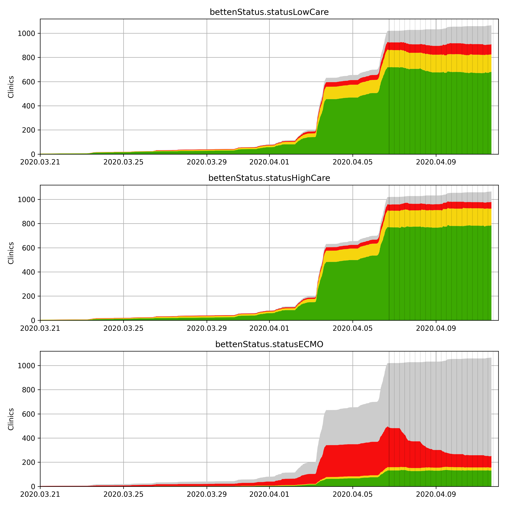

# Plotting utility for ICU capacities in Germany

This repository contains the plotting code for the json-format data scraped by [ICU_Capacities_Germany_Scrape](https://github.com/nvalis/ICU_Capacities_Germany_Scrape).

